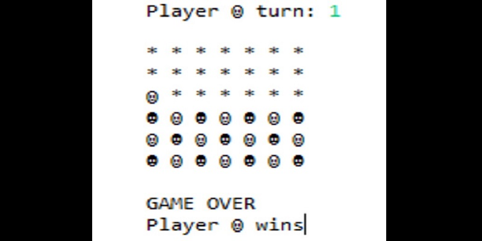

# Connect4Java  

Description:  
Connect Four is a two player strategy game in which the objective
of each player is to line up four of their chips or pieces in a line.
The line can be horizontal, vertical, or diagonal.

Instructions:  
Run the Connect Four game by compiling the game package
and running the Main class.
Place chips by entering a number from 1 to 7 in the command line.
